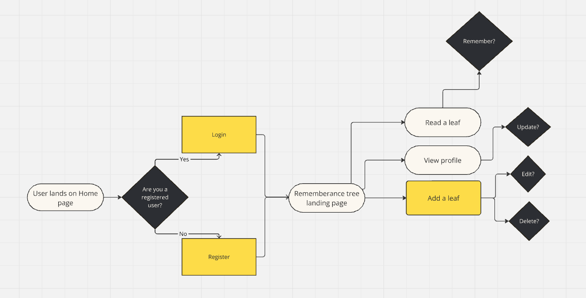
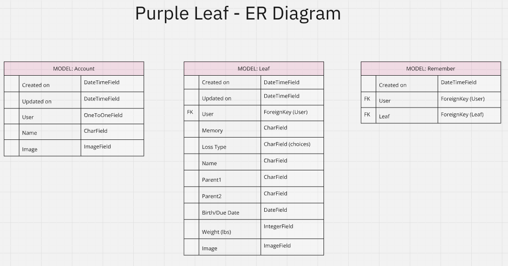

# Purple Leaf

Purple Leaf is a compassionate online platform dedicated to honoring and remembering losses experienced during pregnancy or shortly after birth. It fosters a community of support through the sharing of memories by people who have gone through, or are going through, similar experiences.


[Visit the live website here]()

<br>

## Contents

---

### [User Stories](#user-stories-1)

### [Database](#database-1)

### [Project Structure](#project-structure-1)

- [Apps](#apps)
  - [Accounts](#accounts)
  - [Leaves](#leaves)
  - [Remember](#remember)

### [Technologies](#technologies-1)

### [Version Control](#version-control-1)

### [Deployment](#deployment-1)

### [Testing](#testing-1)

### [Acknowledgements](#acknowledgements-1)

<br>

---

<br>

## User Stories

| User Story                                                                                                             | Epic     |
| :--------------------------------------------------------------------------------------------------------------------- | :------- |
| As a user I can register on the website                                                                                | Accounts |
| As a user I can login using my registration details                                                                    | Accounts |
| As a registered user I can view my own account                                                                         | Accounts |
| As a user I can edit my account and account image so I can keep my account updated                                     | Accounts |
| As a user I can add a leaf to share my memory/experience with the community                                            | Leaves   |
| As a user I can view other leaves by registered users so I can participate in the community                            | Leaves   |
| As a user I can search leaves with keywords so I can read and acknowledge other users who have had similar experiences | Leaves   |
| As a user I can mark another users leaf as remembered to acknowledge their memory has been read                        | Remember |
| As a user I can edit my own leaves so I can correct any errors                                                         | Leaves   |
| As a user I can delete my own leaves so I can remove any unwanted leaves                                               | Leaves   |
| As a user I can view other users’ accounts so I can see all of the leaves they have added                              | Accounts |

<br>

---

## Database

Careful consideration was taken in the planning stages of this project. Initial user journeys were mapped out, and an ER Diagram was created.

### **User Journey**



<br>

### **Database**



<br>

---

## Project Structure

### **Apps:**

Purple Leaf has a total of 3 Apps. These are:

- Accounts
- Leaves
- Remember

These are outlined with their corresponding models below.

#### ACCOUNTS

- Holds the database for any registered users

<br>

#### LEAVES

- Holds the database for all users posted memories

<br>

#### REMEMBER

- Holds the database for all acknowledgments on leaves that indicate the leaf has been read and remembered

<br>

---

## Technologies

### **Languages Used**

This website has been written in Python.

### **Resources**

**Resources, Frameworks, Libraries and Programs Used**

- [Django Rest Framework](https://www.django-rest-framework.org/) - Django toolkit for building APIs
- [Django](https://docs.djangoproject.com/en/5.0/) - Python based web framework
- [Django Filter](https://django-filter.readthedocs.io/en/stable/) - Django-filter allows users to filter dynamically
- [Django All Auth](https://docs.allauth.org/en/latest/) - Authentication and Registration in Django Rest Framework
- [Django Cors Headers](https://pypi.org/project/django-cors-headers/) - Handles the server headers required for Cross-Origin Resource Sharing (CORS)
- [Heroku](https://dashboard.heroku.com/apps) - Deployment platform
- [Cloudinary](https://cloudinary.com/users/login) - Media storage platform
- [Miro](https://miro.com/app/dashboard/) - Designing database diagrams
- [ChatGPT](https://chat.openai.com/) - Troubleshooting more complex bugs
- [Github](https://github.com/)
- [Code Institute DRF Walkthrough Project](https://learn.codeinstitute.net/courses/course-v1:CodeInstitute+DRF+2021_T1/courseware/f775d54df4da44d18309888b3fe884f7/bc5fbada70104d489aa0363a03d8bda8/)
- [Birme.net](https://www.birme.net/?target_height=320&no_resize=true&image_format=webp&quality_webp=100) - resizing images and converting to webp files for README

<br>

---

## Version Control

Version control has been maintained using Git. The code written for this website has been updated via regular commits to Github. These serve as a record of development and changes made.

The commit history can be viewed [here]()

<br>

---

## Deployment

This project is deployed on [Heroku](https://dashboard.heroku.com/apps). Below are the steps taken.

### Setup

#### Prepare your IDE

1. Install dj_database_url and psycopg2

```
pip3 install dj_database_url==0.5.0 psycopg2
```

2. At this point if using Cloudinary you can install now

```
pip3 install dj3-cloudinary-storage
```

3. Create your requirements.txt file

```
pip3 freeze -- local > requirements.txt
```

4. Create your Django project

```
django-admin startproject myprojectname .
```

5. Create your first project app

```
python3 manage.py startapp myappname
```

6. Add your new app to installed apps in your project settings.py

```
INSTALLED_APPS = [
    'django.contrib.admin',
    'django.contrib.auth',
    'django.contrib.contenttypes',
    'django.contrib.sessions',
    'django.contrib.messages',
    'django.contrib.staticfiles',
    'myappname',
]
```

7. Ensure all files are saved
8. Migrate

```
python3 manage.py migrate
```

### Deployment

#### Prepare Heroku

1. Visit [Heroku](https://dashboard.heroku.com/apps)
2. Select 'New' and 'Create New App'
3. Name the app
4. Select region and 'Create App'

#### env.py file

1. Create a new file called 'env.py' in the root directory of your project
2. Add the following code:

```
import os

os.environ['DATABASE_URL'] = 'paste_url_from_database_here'
os.environ['SECRET_KEY'] = 'create_a_secret_key_here'
```

#### settings.py

1. At the top of settings.py just below the Path import, add the following code:

```
import os
import dj_database_url
if os.path.isfile('env.py'):
    import env
```

2. Remove the SECRET_KEY that is in settings and replace with:

```
SECRET_KEY = os.environ.get('SECRET_KEY')
```

3. Comment out the original DATABASES variable and replace with:

```
DATABASES = {
    'default': dj_database_url.parse(os.environ.get('DATABASE_URL'))
}
```

4. Migrate

```
python3 manage.py migrate
```

#### If using Cloudinary

1. Visit [Cloudinary](https://cloudinary.com/users/login) and set up account
2. Copy API environment variable
3. In env.py add:

```
os.environ['CLOUDINARY_URL'] = 'your_cloudinary_api'
```

4. In settings.py add cloudinary_storage and cloudinary to installed apps

```
INSTALLED_APPS = [
    'django.contrib.admin',
    'django.contrib.auth',
    'django.contrib.contenttypes',
    'django.contrib.sessions',
    'django.contrib.messages',
    'cloudinary_storage',
    'django.contrib.staticfiles',
    'cloudinary',
    'myappname',
]
```

5. Near the end of settings.py add:

```
STATIC_URL = '/static/'
STATICFILES_STORAGE = 'cloudinary_storage.storage.StaticHashedCloudinaryStorage'
STATICFILES_DIRS = [os.path.join(BASE_DIR, 'static')]
STATIC_ROOT = os.path.join(BASE_DIR, 'staticfiles')


MEDIA_URL = '/media/'
DEFAULT_FILE_STORAGE = 'cloudinary_storage.storage.MediaCloudinaryStorage'

```

#### Heroku Config Vars

1. Go to your Heroku Dashboard
2. Go to your app and select 'Settings'
3. Click 'Add config vars'
4. Enter the following:

```
DATABASE_URL : your_elephantsql_url
SECRET_KEY : your_secret_key
PORT: 8000
DISABLE_COLLECTSTATIC : 1
CLOUDINARY_URL : your_cloudinary_url
```

#### Templates

1. In settings.py, find BASE_DIR amd add:

```
TEMPLATES_DIR = os.path.join(BASE_DIR, 'templates')
```

2. Midway down your settings.py file change the DIRS to:

```
[TEMPLATES_DIR]
```

#### Allowed Hosts

1. In settings.py, add to 'Allowed Hosts':

```
'myherokuappname.herokuapp.com',
'localhost'
```

#### Add additional files

1. Create 'templates' and 'static' files
2. Add a Procfile (ensure has an uppercase 'P'), with the following line:

```
web: gunicorn myprojectname.wsgi
```

### Deployment

1. Go to Heroku
2. Open your app and select 'Deploy'
3. Select Github as the deployment method
4. Find the correct repository and connect
5. Deploy Branch

When you deploy it is vital that you do not have DEBUG set to True. To overcome this while simultaneously working in the IDE and being deployed you can:

1. In settings.py replace DEBUG=True with:

```
DEBUG = 'DEBUG' in os.environ
```

2. In your env.py file add:

```
os.environ['DEBUG'] = '1'
```

### Create a Superuser

1. In the terminal of your IDE type the following command:

```
python3 manage.py createsuperuser
```

2. Follow the terminal instructions to set up a password

<br>

### Connecting to the Front-End

In order to allow requests from the Front-End, additional config vars need to be added to the Heroku deployment for the API:

```
CLIENT_ORIGIN: your_front_end_url
```

N.B. Ensure the trailling slash from your URL is removed.

<br>

---

## Testing

For all testing details visit the [TESTING]() file.

---

## **Acknowledgements**

This API was built following the Code Institute DRF Walkthrough project
